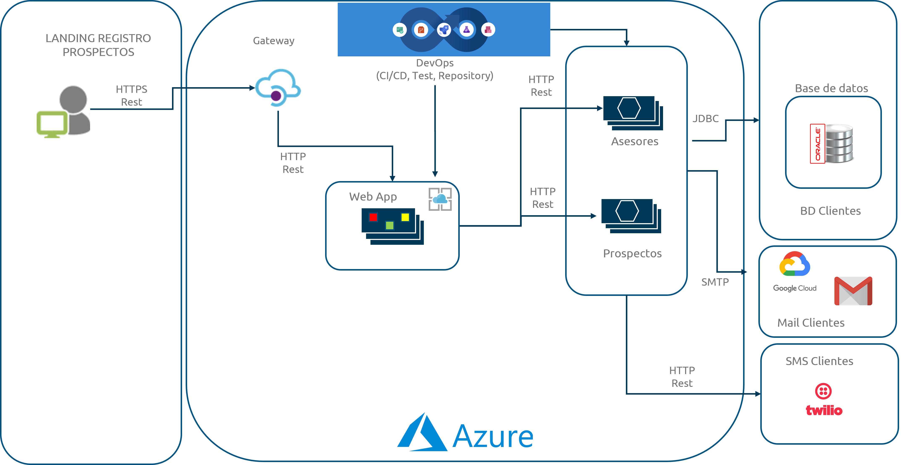
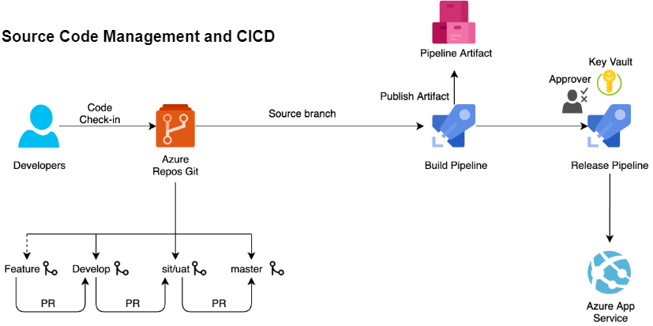

# Demo Landing App

## Resumen

Este repositorio contiene todo el código necesario para hacer funcionar una aplicación web ( *landing de registro* ) basada en una arquitectura de microservicios la cuál permita el registro de nuevos prospectos/clientes a un comercio **ficticio** utilizando la [CURP ](https://www.gob.mx/segob/acciones-y-programas/clave-unica-de-registro-de-poblacion-curp "Clave Única de Registro de Población: CURP") de este como identificador único dentro del sistema.

El funcionamiento de este aplicativo web considera que existe un vendedor/asesor el cual ya está dando el acompañamiento a un posible prospecto y en algún punto de este proceso, esta persona comparte la URL de esta *landing* de registro para capturar a este nuevo prospecto dentro del sistema. De tal suerte que se le pueda dar seguimiento y posiblemente efectuar un hipotético pago al asesor por este trabajo.

Esta solución será desplegada en la nube de Microsoft Azure utilizando muchos de sus servicios más conocidos tales como *máquinas virtuales, web apps, contenedores y api gateways.*

La arquitectura de solución de esta aplicación web se muestra a continuación:



## Flujo de trabajo SCM & CICD

El desarrollo de este aplicativo web considera una metodología agile más los beneficios de una ideología DevOps utilizando la plataforma de Microsoft Azure DevOps.
El flujo de trabajo principalmente consiste en asociar tareas definidas por un backlog para que el desarrollador (tú) pueda trabajar dichas tareas en forma de ramas feature dentro del ambiente de Git.

Una vez completadas dichos cambios se procede a integrar dichos cambios dentro de alguna de las ramas principales (develop o master/main) de tal suerte que se puedan ejecutar algunos de los procesos de CI/CID que la ideología de DevOps propone.

Para esta demostración, solo se utilizarán los conceptos CI/CD para desplegar nuestro aplicativo web en un ambiente de desarrollo personal para pruebas internas.

Lo antes mencionado puede quedar mucho mejor explicado en la siguiente imagen.



## Microsoft Azure

Hasta este punto se ha mencionado o insinuado que se utilizarán varios servicios de la nube de Microsoft Azure.

Antes de revisar todo el código y demás recursos te invito a que primero logres tener una cuenta activa y debidamente configurada en los siguientes sitios:

* Portal Azure ([https://portal.azure.com/](https://portal.azure.com/))
* Plataforma Azure DevOps ([https://dev.azure.com/](https://dev.azure.com/))

Es importante que tengas acceso a dichas plataformas ya que se utilizarán de forma recurrente a lo largo de esta demostración y es conveniente que no te atores en estos puntos a modo de evitar cualquier retraso en la misma.

### How to...?

Te dejamos algunos tutoriales que la comunidad de internet ha compartido en diversos formatos a fin de que puedas guiarte con ellos y lograr tener tus cuentas activas y configuradas.

* [Is Azure Free Account really free?](https://youtu.be/0KEfaUfolVs?si=j9S9WxAVa4gLS1Rl "https://youtu.be/0KEfaUfolVs?si=j9S9WxAVa4gLS1Rl")
* [Create Your Azure Free Account Or Pay As You Go | Microsoft Azure](https://azure.microsoft.com/en-us/pricing/purchase-options/azure-account "https://azure.microsoft.com/en-us/pricing/purchase-options/azure-account")
* [What is Azure DevOps? | One Dev Question: Abel Wang ](https://youtu.be/p9MPBzXBJ_w?si=BkqqbktyrOhZV0z7 "https://youtu.be/p9MPBzXBJ_w?si=BkqqbktyrOhZV0z7")
* [Azure DevOps Tutorial for Beginners | CI/CD with Azure Pipelines](https://youtu.be/4BibQ69MD8c?si=ogvxUIalu8qoG38M "https://youtu.be/4BibQ69MD8c?si=ogvxUIalu8qoG38M")
* [Sign up for Azure DevOps](https://learn.microsoft.com/en-us/azure/devops/user-guide/sign-up-invite-teammates?view=azure-devops&tabs=microsoft-account "https://learn.microsoft.com/en-us/azure/devops/user-guide/sign-up-invite-teammates?view=azure-devops&amp;tabs=microsoft-account")

# Microsoft Azure

Para que tú puedas seguir paso a paso esta demostración, deberás tener los siguientes requisitos listos y debidamente configurados.

Cloud:

1. Cuenta en el portal de Microsoft Azure.
2. Cuenta en el portal de Azure DevOps (idealmente debería ser la misma que el punto #1)
3. Organización y proyecto creados dentro de la plataforma de Azure DevOps (del punto #2)

Software:

1. Angular 15
2. NodeJS 20
3. OpenJDK 11
4. Maven 3.9.4

Herramientas de desarrollo:

1. Visual Studio Code
2. Visual Studio
3. Spring Boot Extension Pack
4. Oracle SQL Developer
5. Oracle SQL Data Modeler
6. Postman
7. Docker Desktop
8. Git
9. Powershell

## Estructura del repositorio

Para una mejor comprensión de este repositorio a continuación, se describe cada uno de los componentes que aquí se tienen.

Carpeta "f*ront* : Esta carpeta contiene el código escrito en Angular para la parte web de esta “*landing de registro”.*

Carpeta "back": Esta carpeta contiene el código de los microservicios de esta aplicación, escritos en Java utilizando el *framework* de *SpringBoot.*

Carpeta "database": Esta carpeta contienen todos aquellos *scripts* de base de datos que permiten tanto la creación de la base de datos como el llenado inicial de la misma.

Carpeta "images": Esta carpeta contiene aquellas imagenes que complementan las explicaciones de este repositorio.

```bash
.
├── images
├── back
│   ├── README.md
│   ├── ms-asesores
│   └── ms-prospectos
├── cloud
│   ├── README.md
├── database
│   ├── README.md
├── front
│   ├── README.md
```

# Feedback

* [Reportar un issue](https://github.com/xavokill/demo-landing-app/issues)
* [Contacto](mailto:xavier.hernandez.app@outlook.com)

# Licenciamiento

[MIT](https://github.com/xavokill/demo-landing-app/blob/main/LICENSE)
