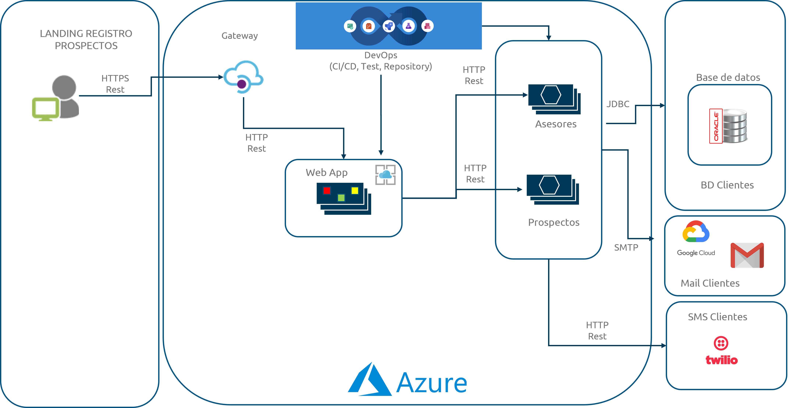
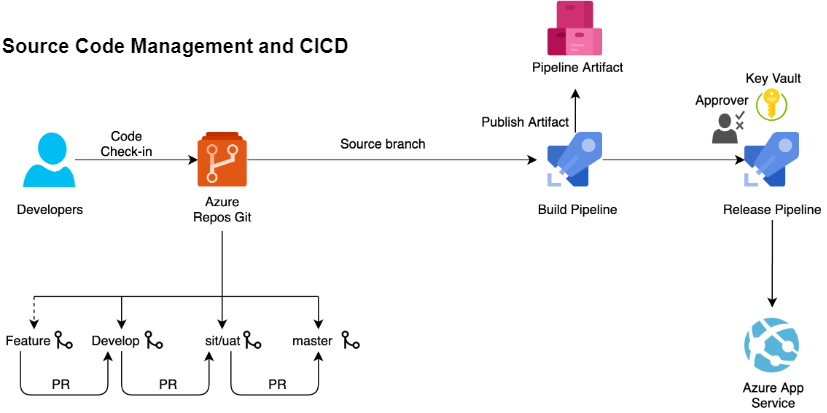

# DEMO LANDING APP

## Resumen

Este repositorio contienen el código para un sistema que registra nuevos prospectos de un comercio **fictisio** utilizando el [CURP ](https://www.gob.mx/segob/acciones-y-programas/clave-unica-de-registro-de-poblacion-curp "Clave Única de Registro de Población: CURP")como identificador único.

La arquitectura de solución de esta aplicación se muestra a continuación:



Esta solución contempla el uso de Microsoft Azure como principal proveedor de nube, así como una arquitectura basada en micro servicios.

### Stack tecnológico

Las siguientes tecnoloías se usarán para desarrollar este sistema:

* Angular 15
* Springboot 3.2.5
* Java 11 utilzando OpenJDK
* Oracle DB 19c
* Docker 4.15
* Git 2.40

Los siguientes recursos se usarán para desplegar este sistema en la nube de Microsoft Azure:

* Virtual Machine
* Web app
* Container Registry
* Api Gateway
* Azure DevOps

### Supuestos

Los siguientes elementos quedan fuera del alcance de este repositorio:

* El código colocado en este repositorio solo contienen el mínimo necesario para implementar la funcioanlidad aquí descrita.
* No se cargarán valores de propiedades que hagan alución a un ambiente en particular.
* Es necesario cambiar todo aquel archivo de configuración por valores propios.
* Ya se tiene una subscripción de Microsoft Azure lista para ser usada.
* Ya se tiene una organización y un proyceto creados en Azure Devops listos para ser usados.
* Todo cargo que se genere en la subscripción de Microsoft Azure por uso de esta demostración queda acargo del usuario/desarrollador y no por el dueño de este repositorio.

## Estructura del repositorio

Este repositorio contiene la siguiente estructura de carpetas, las cuales represntan cada uno de los componentes de este sistema.

```bash
.
├── resources
├── back
│   ├── ms-asesores
│   └── ms-prospectos
├── cloud
│   ├── README.md
├── database
│   ├── README.md
├── front
│   ├── README.md
```

### Componentes "back"

Esta carpeta contienen cada uno de los microservicios involucrados en el funcionamiento interno de este sistema.

### Componentes "front"

Esta carpeta contienen el componente web "*landing*", el cual contiene el  flujo principa del sistema, registro de los prospectos.

### Componentes "database"

Esta carpeta contienen todos aquellos scrips de base de datos que permiten tanto la creación como el llenado inicial de la base de datos.

### Componentes "cloud"

Esta carpeta contienen todos aquellos ejemplos que petmiten el despliegue (y de distintas maneras) de este sistema en la nube de Azure.

## DevOps

Este sistema estrá bajo un flujo de *integración y despliegue continuo* utilizando la plataforma de Azure DevOps como se muestra a continuación:


