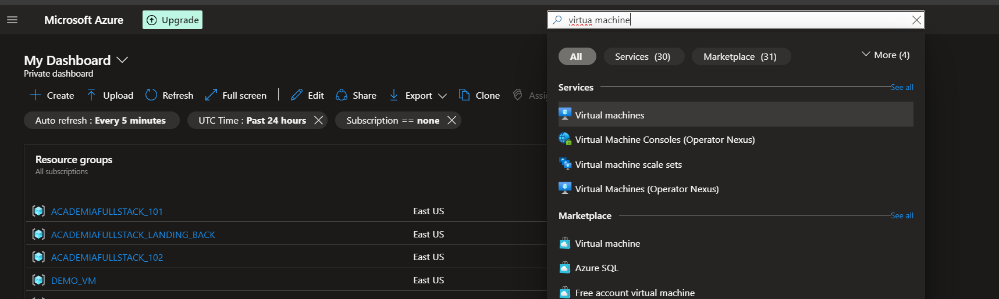
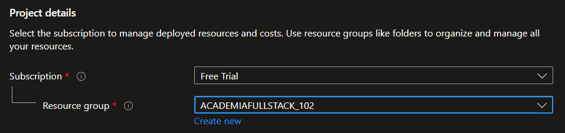
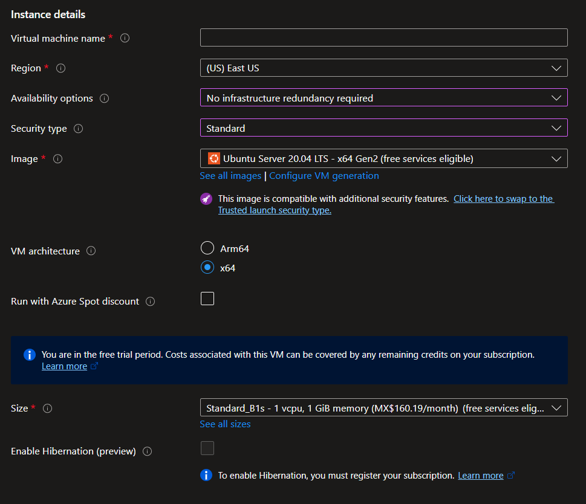
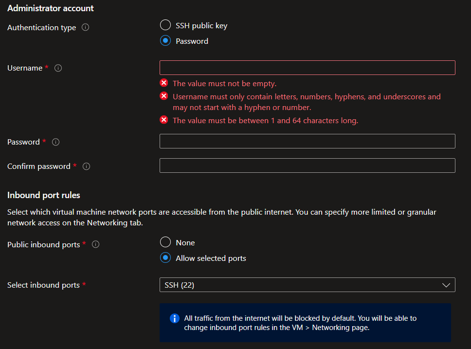
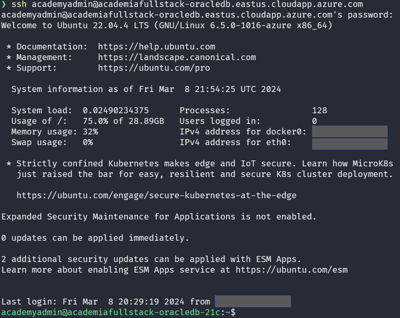

# Forma #1 - Básica (enfoque IasS)

Recuerda que estamos desplegando una aplicación web y lo mínimo que se requiere un servidor web que sea accesible a su público objetivo, en este caso a todo el mundo.

Este es un enfoque IasS (*Infrastructure as a service*) lo que significa que estaremos montando un servidor "físico" para manualmente configurarlo y posteriormente desplegar nuestra solución.

## PASO 1: Crear una máquina virtual en Azure

Una vez entras a tu [portal de azure](https://portal.azure.com/) deberas ver una imágen similar a la que se muestra debajo. En la bárra de búsqueda escribe "_virtual machine_" y da clic en el primer resultado que veas.



En la nueva pantalla mostrada se mostrán aquellas máquinas virtuales que tengas actualmente. Para crear una nueva máquina virtual da clic en el menú ***"Create"***, luego selecciona la opción **Azure virtual machine"**.

```c
// ## Nota: ##

/* 
Para este ejercicio, únicamente mostraremos las secciones del asistente que vamos a modificar, las demás secciones se quedarán con sus valores predeterminados
*/
```

### Configurando la sección "Basics"

Esta sección es una de las más importantes, en ella podremos seleccionar tanto el tamaño de nuestra máquina virtual como el tipo de seguridad que tendrá.

Ingresa los siguientes datos que se muestran debajo pero cuidado, los datos que estén en blanco tú los deberás llenar con tu propia información.

#### Project details

Selecciona del menú desplegable la subscripción que usarás con esta máquina virtual.

Si no tienes  ingun **resource group** creado puedes crear uno con el botón *create new*, de lo contrario seleciona uno del menú desplegable.



#### Instance details

Aqui ingresaremos los siguientes datos.



#### Administrator account

Aqui ingresaremos la cuenta administradora del servidor. Una vez completado da clic en el botón de color **"Review + Create".**

```c
// ## Nota: ##

/* 
Recuerda conservar estos datos ya que se usarán en pasos mas adelante.
*/
```



Una vez se validen todos los campos y veas una leyenda de color verde verificando que todo esta correcto procede a dar clic en el boton **"create"** y espera a que termine el proceso de despligue.


Despues de que se complete el proceso de despligue da clic en el boton **"Go to resource"**


## PASO 2:  Configurar la máquina virtual

Una vez tengamos nuestra máquina virtual es momento de acceder a ella para configurarla.

Lo primero es acceder a ella a travéz del protocolo SSH.

Recuerda tener a la mano la ip de tu máquina virtual, el usuario y contraseña de tu servidor (lo configuraste en pasos anteriores).

```c
// ## Nota: ##

/* 
Deberás cambiar los datos mostrados en estos ejemplos con tus propios datos.
*/
```

Abre una terminal en tu equipo y escribe el sigiuiente comando.

```shell

ssh azureadmin@academiafullstackvm.eastus.cloudapp.azure.com
azureadmin@academiafullstackvm.eastus.cloudapp.azure.com's password:
```

 Ingresa la contraseña del usuario.

```shell

ssh azureadmin@academiafullstackvm.eastus.cloudapp.azure.com
azureadmin@academiafullstackvm.eastus.cloudapp.azure.com's password:
```

Una vez validado todo, deberas ver una pantalla similar a la siguiente.




### Actualizando el servidor

Es una muy buena practiva que al montar una nueva máquina actulicemos todas sus dependencias ya que nos aseguramos de contar con todos los fixes aprobados.

En este ejemplo usa los siguientes comandos para actualizar tu servidor ubuntu.

```bash
azureadmin@academiafullstackvm:~$ sudo apt update
```

```bash
azureadmin@academiafullstackvm:~$ sudo apt -y upgrade
```

### Instalando Java

En este ejemplo usaremos OpenJDK para instalar tanto el JRE como el JDK en su versión 17. Sigue los comandos mostrados.

```bash
azureadmin@academiafullstackvm:~$ sudo apt install openjdk-17-jdk openjdk-17-jre -y
```

```bash
azureadmin@academiafullstackvm:~$ java -version
openjdk version "17.0.10" 2024-01-16
OpenJDK Runtime Environment (build 17.0.10+7-Ubuntu-122.04.1)
OpenJDK 64-Bit Server VM (build 17.0.10+7-Ubuntu-122.04.1, mixed mode, sharing)
```

### Instalando Maven

Sigue los comandos mostrados debajo.

```bash
azureadmin@academiafullstackvm:~$ sudo apt install maven -y 
azureadmin@academiafullstackvm:~$ mvn -version
```

### Compilando y Ejecutando

Una vez configurado JAVA y MAVEN podemos ejecutar los siguientes comandos para compilar y ejecutar los microservicios.

```bash
azureadmin@academiafullstackvm:~$ cd <path_to_code>
azureadmin@academiafullstackvm:~$ mvn install
azureadmin@academiafullstackvm:~$ java -jar  <path to jar>
```